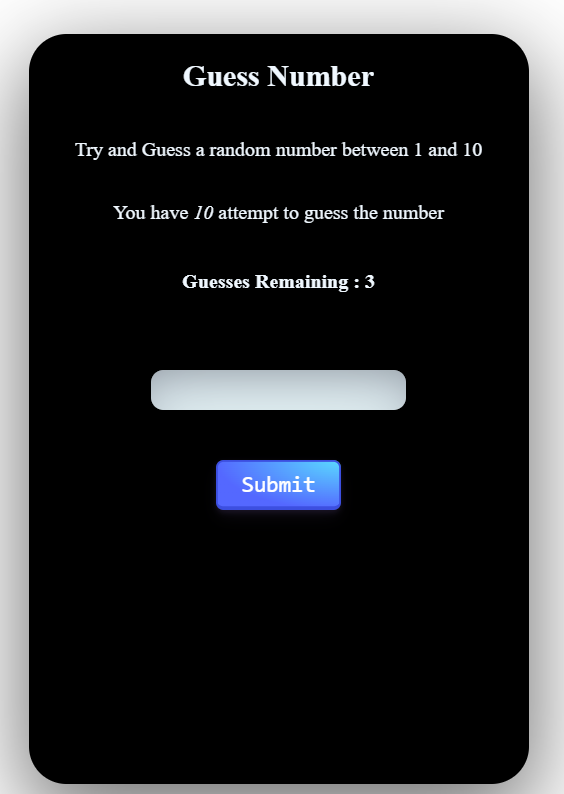

# Guess Number Js project

## webTools Used : HTML,CSS,JS

### HTML
```HTML
<!DOCTYPE html>
<html lang="en">
  <head>
    <title>Home</title>
    <meta charset="UTF-8" />
    <meta name="viewport" content="width=device-width" />
    <link rel="stylesheet" href="styles.css" />
    <script type="module" src="script.js"></script>
  </head>
  <body>
    <div class="main">
      <h2>Guess Number</h2>
      <p>Try and Guess a random number between 1 and 10</p>
      <p>You have <i>10</i> attempt to guess the number</p>
      <h4 class="remGuess"></h4>
      <input type="text" class="ip" />
      <button type="submit" class="btn" id="submit">Submit</button>
      <h4 class="prevGuess"></h4>
      <h4 class="status"></h4>
    </div>
  </body>
</html>
```
### CSS
```css
body {
  display: flex;
  flex-direction: column;
  justify-content: center;
  align-items: center;
}
.main {
  background-color: black;
  color: aliceblue;
  width: 400px;
  height: 600px;
  border-radius: 30px;
  display: flex;
  flex-direction: column;
  align-items: center;
  box-shadow: rgba(0, 0, 0, 0.56) 0px 22px 70px 4px;
  margin-top: 20px;
}
.ip {
  width: 200px;
  height: 30px;
  border-radius: 10px;
  border: none;
  background-color: azure;
  box-shadow: rgba(50, 50, 93, 0.25) 0px 30px 60px -12px inset,
    rgba(0, 0, 0, 0.3) 0px 18px 36px -18px inset;
  margin: 40px 0;
}
#newgm {
  background-color: rgb(54, 209, 93) !important;
}
.btn {
  width: 100px;
  height: 30px;
  border-radius: 10px;
  border: none;
  background-color: rgb(54, 183, 209);
  box-shadow: rgba(50, 50, 93, 0.25) 0px 50px 100px -20px,
    rgba(0, 0, 0, 0.3) 0px 30px 60px -30px,
    rgba(10, 37, 64, 0.35) 0px -2px 6px 0px inset;
}
.btn {
  align-items: center;
  appearance: none;
  background-image: radial-gradient(
    100% 100% at 100% 0,
    #5adaff 0,
    #5468ff 100%
  );
  border: 0;
  border-radius: 6px;
  box-shadow: rgba(45, 35, 66, 0.4) 0 2px 4px,
    rgba(45, 35, 66, 0.3) 0 7px 13px -3px, rgba(58, 65, 111, 0.5) 0 -3px 0 inset;
  box-sizing: border-box;
  color: #fff;
  cursor: pointer;
  display: inline-flex;
  font-family: 'JetBrains Mono', monospace;
  height: 40px;
  justify-content: center;
  line-height: 1;
  list-style: none;
  overflow: hidden;
  padding-left: 16px;
  padding-right: 16px;
  position: relative;
  text-align: left;
  text-decoration: none;
  transition: box-shadow 0.15s, transform 0.15s;
  user-select: none;
  -webkit-user-select: none;
  touch-action: manipulation;
  white-space: nowrap;
  will-change: box-shadow, transform;
  font-size: 18px;
}
.btn {
  box-shadow: #3c4fe0 0 0 0 1.5px inset, rgba(45, 35, 66, 0.4) 0 2px 4px,
    rgba(45, 35, 66, 0.3) 0 7px 13px -3px, #3c4fe0 0 -3px 0 inset;
}
.btn:hover {
  box-shadow: rgba(45, 35, 66, 0.4) 0 4px 8px,
    rgba(45, 35, 66, 0.3) 0 7px 13px -3px, #3c4fe0 0 -3px 0 inset;
  transform: translateY(-2px);
}
.btn:active {
  box-shadow: #3c4fe0 0 3px 7px inset;
  transform: translateY(2px);
}
```

### Javascript
```javascript
let remainGuess = document.querySelector('.remGuess');
let count = 3;
remainGuess.innerHTML = `Guesses Remaining : ${count}`;
let fixedNumber = Math.round(Math.random() * 10);
let prev = document.querySelector('.prevGuess');
let prevGuess = 0;

const submitBtn = document.querySelector('#submit');
submitBtn.addEventListener('click', () => {
  const val = document.querySelector('.ip').value;
  if (checkVal(val) && count >= 1) {
    const result = validateGuess(val);
    if (result) addNewGame();
    remainGuess.innerHTML = `Guesses Remaining : ${--count}`;
    if (prevGuess > 0) prev.innerHTML = `Previous Guess : ${prevGuess}`;
    prevGuess = val;
    console.log(fixedNumber);
  }
  if (count === 0 && prev != fixedNumber) {
    count--;
    const status = document.querySelector('.status');
    status.innerHTML = `Game Over 😔, Actual Number was ${fixedNumber}`;
    addNewGame();
  }
  document.querySelector('.ip').value = '';
});

function checkVal(val) {
  const status = document.querySelector('.status');
  if (isNaN(val) || !(val >= 1 && val <= 10)) {
    status.innerHTML =
      'Please guess and enter a valid number between 1 and 100';
    return false;
  }
  return true;
}

function validateGuess(val) {
  const status = document.querySelector('.status');
  if (val > fixedNumber) {
    status.innerHTML = 'Your Guess Number is greater than Actual number';
  } else if (val < fixedNumber) {
    status.innerHTML = 'Your Guess Number is lower than Actual number';
  } else {
    status.innerHTML = 'Yeh!!! 🎉🎉🎉 You guess the correct number ';
    return true;
  }
  return false;
}

function addNewGame() {
  // creting new element
  const status = document.querySelector('.status');
  const newGame = document.createElement('button');
  newGame.className = 'btn';
  newGame.id = 'newgm';
  newGame.innerHTML = 'New Game';
  newGame.style.backgroundColor = 'green !important';
  const main = document.querySelector('.main');
  if (!main.querySelector('#newgm')) main.appendChild(newGame);

  newGame.addEventListener('click', () => {
    count = 3;
    prevGuess = 0;
    status.innerHTML = '';
    prev.innerHTML = '';
    remainGuess.innerHTML = `Guesses Remaining : ${count}`;
    fixedNumber = Math.round(Math.random() * 10 + 1);
    newGame.remove();
  });
}
```


